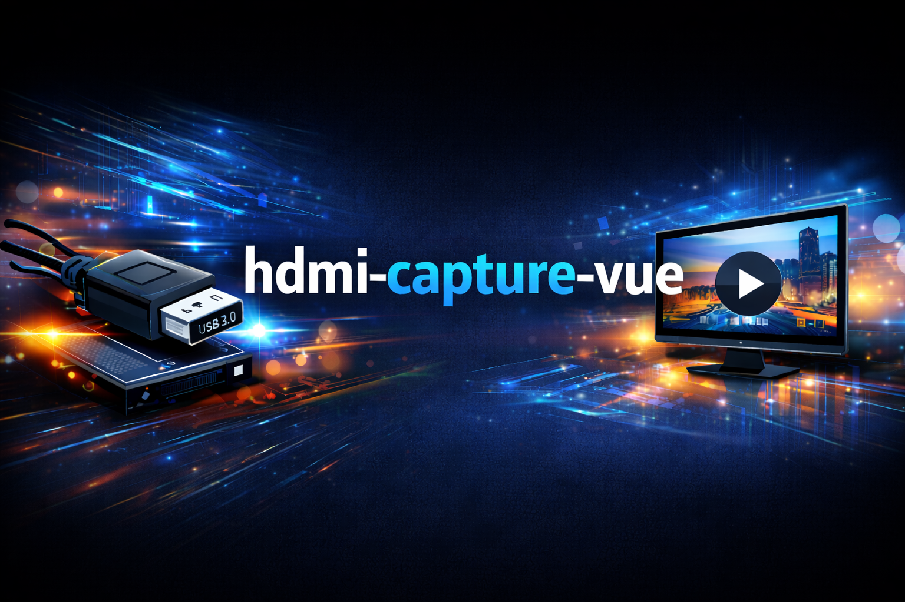
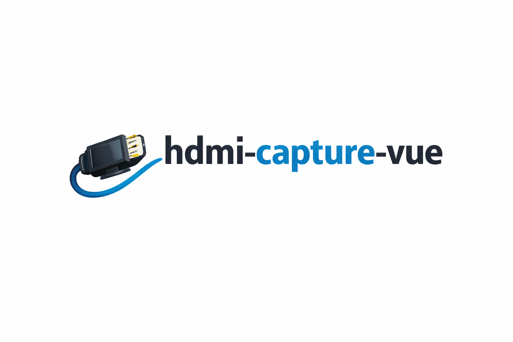

<p align="center">
  
</p>

<h1 align="center">HDMI Capture Vue</h1>

<p align="center">
  Browser-based HDMI capture viewer for USB UVC devices
</p>

<p align="center">
  
  
  
</p>

---

## 📌 Overview

**HDMI Capture Vue** is a lightweight **browser-based HDMI capture viewer** built using **Python, OpenCV, and Flask**.

It allows you to view HDMI input from **USB 3.0 UVC capture cards** directly in your web browser with **low latency**, without OBS, FFmpeg, or vendor software.

✔ Windows & Linux  
✔ USB HDMI capture cards  
✔ MJPEG streaming  
✔ Runs globally (no virtual environment required)

---

## ✨ Features

- Live HDMI preview in browser
- MJPEG streaming (low latency)
- Fullscreen responsive UI
- Manual control of resolution and FPS
- USB capture card enumeration (Windows)
- FPS & resolution capability testing
- Works with webcams and HDMI capture cards
- Simple, dependency-light design

---

## 🔌 Supported Devices

### Supported
- USB 3.0 HDMI capture cards (UVC)
- HDMI → USB adapters
- DSLR / mirrorless cameras (HDMI out)
- Gaming consoles (PS / Xbox / Switch)
- HDMI output from another PC/laptop
- Standard UVC webcams

### Not Supported
- Proprietary driver–only capture cards
- Non-UVC devices

**Rule:**  
If the device shows as a *camera* in OBS or system camera apps, it will work.

---

## 🧠 How It Works

HDMI Source → USB Capture Card → OpenCV → Flask MJPEG → Browser

---

## 📂 Project Structure

```
.
├── usb_capture_viewer.py
├── usb_capture_device_tester.py
├── assets/
│   ├── logo.png
│   └── banner.png
├── requirements.txt
├── LICENSE
└── .gitignore
```

---

## ⚙️ Requirements

- Python 3.9+
- USB UVC HDMI capture card
- HDMI source device

---

## 🚀 Installation (Global)

```bash
pip install -r requirements.txt
```

---

## ▶️ Running the Viewer

```bash
python usb_capture_viewer.py
```

Viewer UI: http://localhost:5505  
MJPEG Stream: http://localhost:5505/video

---

## 🛠️ Configuration

Edit the configuration section in `usb_capture_viewer.py`:

```python
DEVICE_INDEX = 2
WIDTH = 1920
HEIGHT = 1080
FPS = 30
PORT = 5505
OPEN_BROWSER = True
```

---

## 🧪 Debugging & Troubleshooting

### Camera cannot be opened
- Wrong device index
- Camera already in use
- Device not detected

### Black screen
- HDMI source inactive
- Unsupported resolution
- No HDMI signal

### Low FPS
- USB bandwidth limitation
- Capture card chipset limit

Check console logs for detailed diagnostics.

---

## 🤝 Contributing

Contributions are welcome. Please keep changes small and well-tested.

---

## 📜 License

MIT License

---

## ⭐ Credits

OpenCV • Flask • pyusbcameraindex
